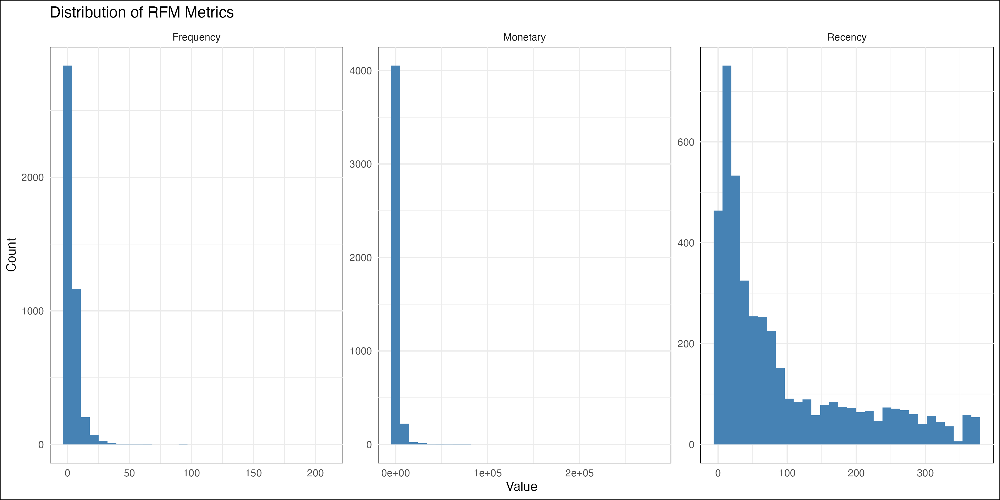
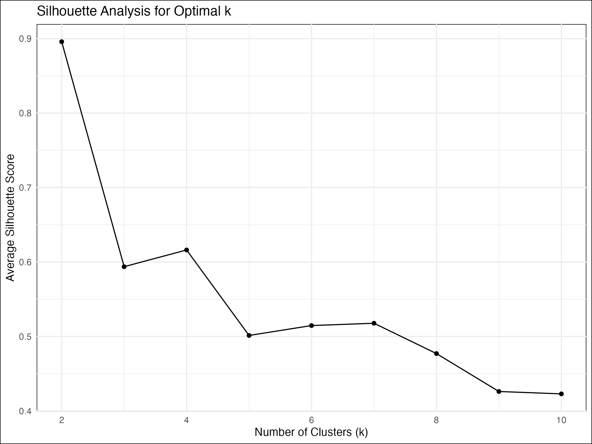
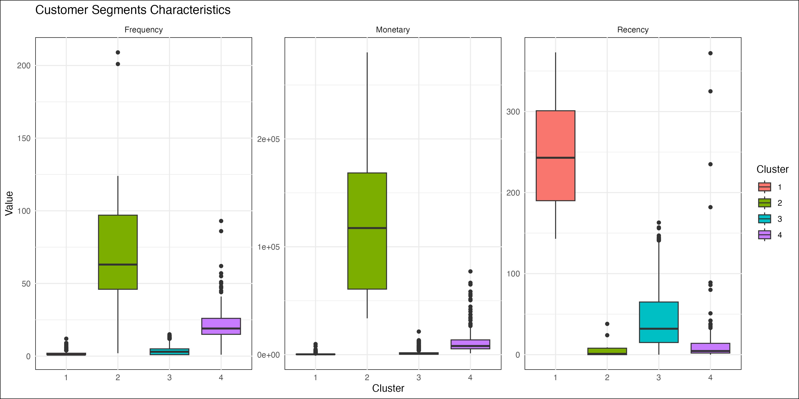
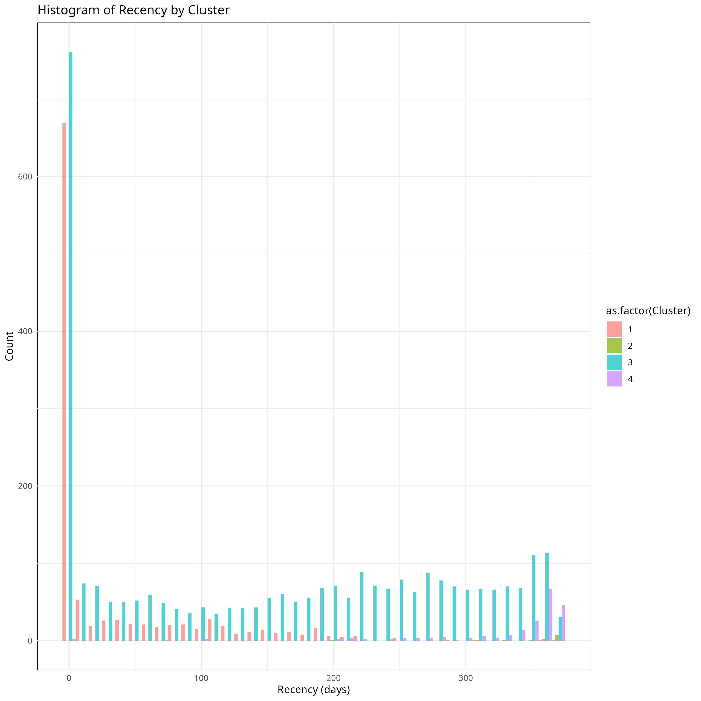
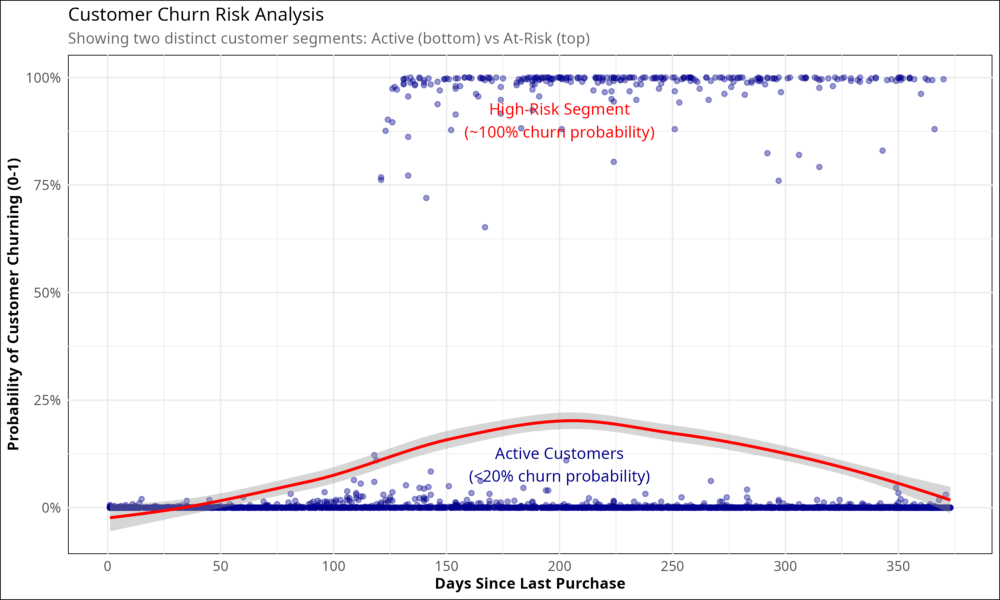
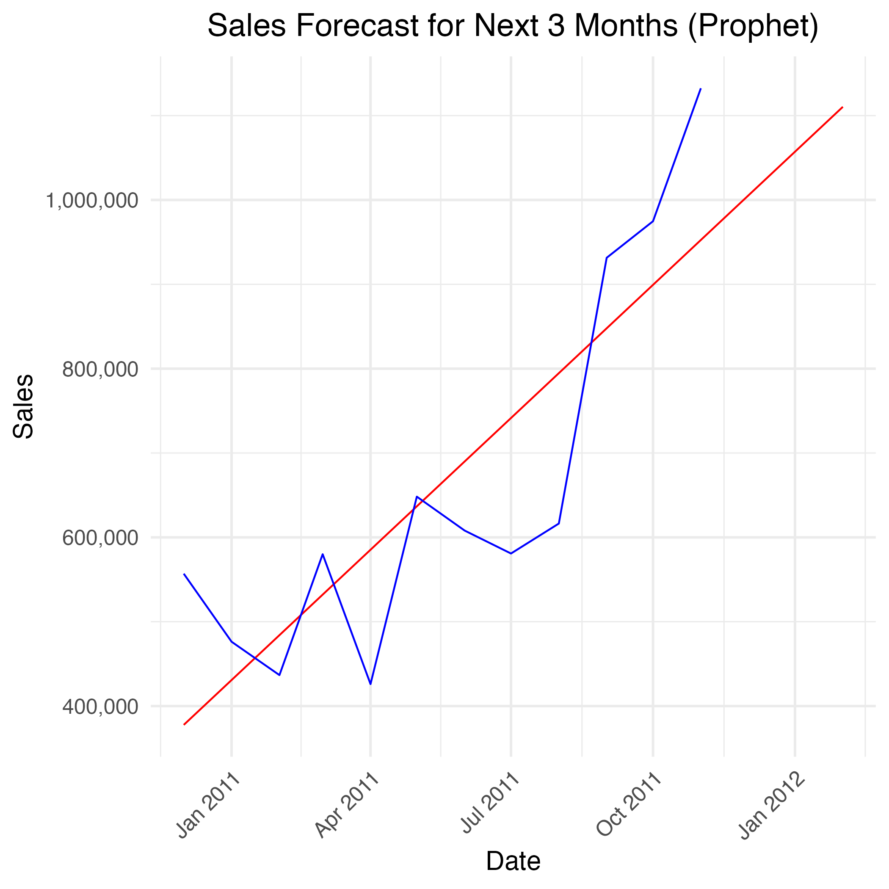

# E-commerce Customer Segmentation Analysis Using RFM and Advanced Clustering Techniques

Copyright © 2024 John ten Bosch Jr. All rights reserved.

**Author:** John ten Bosch Jr.
**Affiliation:** Business Analytics, San Francisco State University  
**Contact:** gojack10@gmail.com

## Abstract
This study presents a comprehensive analysis of customer segmentation in e-commerce using RFM (Recency, Frequency, Monetary) analysis and advanced clustering techniques. Using a dataset from the UCI Machine Learning Repository, we implemented K-means clustering to identify distinct customer segments and developed a systematic approach for customer behavior analysis. Our findings reveal four primary customer clusters with distinct characteristics, providing actionable insights for targeted marketing strategies and customer relationship management.

## I. Introduction
In today's competitive e-commerce landscape, understanding customer behavior and effectively segmenting customers has become crucial for business success. Customer segmentation in e-commerce involves dividing the customer base into distinct groups based on shared characteristics such as purchasing behavior, demographics, browsing patterns, and lifetime value. This segmentation enables businesses to:
- Tailor marketing strategies to specific customer groups
- Optimize product recommendations
- Customize user experiences based on segment characteristics
- Improve conversion rates and customer retention
- Enhance average order value through personalized approaches

The importance of data-driven decision-making in this context cannot be overstated, as it allows businesses to move beyond intuition-based strategies to measurable, empirical approaches.

## II. Methodology

### A. Data Preparation
The study utilized the online retail dataset from the UCI Machine Learning Repository. The data preparation process involved several key steps:

1. Data Cleaning:
   - Removal of missing values
   - Elimination of negative quantities and prices
   - Conversion of invoice dates to proper datetime format
   - Filtering of invalid customer IDs

2. Feature Engineering:
   - Implementation of RFM metrics:
     - Recency: Days since last purchase
     - Frequency: Number of distinct purchases
     - Monetary: Total amount spent
   - Scaling of RFM values for clustering accuracy

The RFM features are calculated using the following approach:
```R
rfm_data <- clean_retail_data %>%
  group_by(CustomerID) %>%
  summarise(
    # Recency: days since last purchase
    Recency = as.numeric(difftime(max_date, max(InvoiceDate), units = "days")),
    # Frequency: number of purchases
    Frequency = n_distinct(InvoiceNo),
    # Monetary: total money spent
    Monetary = sum(Quantity * UnitPrice)
  ) %>%
  # Remove any rows where CustomerID is NA
  filter(!is.na(CustomerID))
```

Mathematically, this can be expressed as:

$$R_i = max(Date) - max(Date_i)$$
$$F_i = |distinct(InvoiceNo_i)|$$
$$M_i = \sum_{j=1}^{n_i} (Quantity_{ij} \cdot UnitPrice_{ij})$$

Where:
- $R_i$ is the recency for customer $i$
- $F_i$ is the frequency for customer $i$
- $M_i$ is the monetary value for customer $i$
- $n_i$ is the number of transactions for customer $i$

### B. Clustering Algorithms and Initial Analysis



The initial analysis of RFM metrics revealed distinct patterns in customer behavior:

1. Frequency Distribution:
   - Highly left-skewed distribution
   - Majority of customers with low purchase frequency (<50 purchases)
   - Small subset of highly frequent purchasers

2. Monetary Distribution:
   - Extreme left-skew with long tail
   - Most customers in lower spending brackets
   - Few high-value outliers representing major revenue contributors

3. Recency Distribution:
   - More uniform distribution compared to other metrics
   - Gradual decline in customer counts with increasing recency
   - Notable long tail indicating potential churn risks

The k-means clustering algorithm minimizes the following objective function:

$$J = \sum_{i=1}^{n} \sum_{j=1}^{k} w_{ij} ||x_i - \mu_j||^2$$

Where:
- $J$ is the objective function to minimize
- $n$ is the number of data points
- $k$ is the number of clusters
- $w_{ij}$ is 1 if point $i$ belongs to cluster $j$, 0 otherwise
- $x_i$ is the feature vector for point $i$
- $µ_j$ is the centroid of cluster $j$

```R
# k-means clustering with optimal k
optimal_k <- 4
final_clusters <- kmeans(rfm_scaled, centers = optimal_k, nstart = 25)

rfm_clustered <- rfm_data %>%
  mutate(Cluster = factor(final_clusters$cluster))
```

The optimal number of clusters was determined through two complementary methods:



1. Silhouette Analysis:
   - Highest score at k=2 (0.89)
   - Notable drop after k=4 (0.62)
   - Diminishing returns beyond k=4
   - Supports selection of 4 clusters for balance between granularity and cohesion


2. Elbow Method:
   - Sharp decline in within-cluster sum of squares until k=4
   - Flattening of curve after k=4
   - Confirms optimal cluster count of 4
   - Additional clusters provide minimal reduction in variance

## III. Results Analysis

### A. Segment Profiling



The analysis revealed four distinct clusters with unique characteristics:

1. Cluster 3 (Potential Loyalists):
   - Size: 3,060 customers (70.54%)
   - Average Recency: 43.43 days
   - Average Frequency: 3.68 purchases
   - Average Monetary Value: $1,358.17
   - Moderate RFM scores (R: 3.51, F: 3.22, M: 3.20)

2. Cluster 1 (Average Customers):
   - Size: 1,061 customers (24.46%)
   - Average Recency: 248.17 days
   - Average Frequency: 1.55 purchases
   - Average Monetary Value: $478.19
   - Lower RFM scores (R: 1.19, F: 1.98, M: 2.01)

3. Cluster 4 (Champions):
   - Size: 204 customers (4.70%)
   - Average Recency: 14.96 days
   - Average Frequency: 22.33 purchases
   - Average Monetary Value: $12,709.09
   - High RFM scores (R: 4.62, F: 4.96, M: 4.99)

4. Cluster 2 (VIP Customers):
   - Size: 13 customers (0.30%)
   - Average Recency: 6.62 days
   - Average Frequency: 82.54 purchases
   - Average Monetary Value: $127,338.31
   - Highest RFM scores (R: 4.77, F: 4.85, M: 5.00)

### B. Detailed Value Distribution Analysis


The monetary value distribution across clusters reveals distinct spending patterns:

1. VIP Customers (Cluster 2):
   - Highest median monetary value (~85,000)
   - Substantial interquartile range (45,000-130,000)
   - Notable outliers exceeding 200,000
   - Clear separation from other clusters

2. Champions (Cluster 4):
   - Moderate monetary values (median ~15,000)
   - Compact distribution with some high-value outliers
   - Consistent spending patterns

3. Average & Potential Loyalists (Clusters 1 & 3):
   - Similar monetary distributions
   - Lower median values (<5,000)
   - Minimal variance in spending
   - Occasional outliers indicating growth potential

#### Recency Patterns



The recency distribution highlights engagement patterns:

1. Recent Engagement:
   - Clusters 1 & 3 show high concentration in 0-50 day range
   - Clear peak in very recent activity (<30 days)
   - Strong active customer base

2. Temporal Distribution:
   - Cluster 3 shows even distribution across time periods
   - Cluster 1 concentrated in recent periods
   - Long tail extending to 350+ days
   - Natural segmentation points at 100 and 200 days

#### Value-Frequency Relationship


The relationship between purchase frequency and monetary value reveals:

1. Cluster Characteristics:
   - Cluster 2: High frequency and high value, clear outliers
   - Cluster 4: Moderate frequency, consistent value
   - Cluster 3: Low to moderate frequency, variable value
   - Cluster 1: Low frequency, low value concentration

### C. Churn Risk Analysis


The study implemented a comprehensive churn risk assessment framework that revealed distinct patterns:

For the churn risk analysis, we calculate an engagement score:

```R
    Engagement_Score = (
      scale(Frequency) + 
      scale(Monetary) + 
      scale(-Recency)
    ) / 3
```

Mathematically represented as:

$$E_i = \frac{Z(F_i) + Z(M_i) - Z(R_i)}{3}$$

Where:
- $E_i$ is the engagement score for customer $i$
- $Z()$ is the standardization function
- $F_i$, $M_i$, and $R_i$ are the frequency, monetary, and recency values respectively

1. Active Customers:
   - Maintain consistently low churn probability (<20%)
   - Show regular engagement patterns
   - Demonstrate stable purchasing behavior

2. High-Risk Segment:
   - Display nearly 100% churn probability
   - Typically inactive for >150 days and have low or no purchases
   - Sharp transition point around 150-day mark
   - Clear separation from active customer base



Further analysis of transaction patterns reveals clear clustering of high-risk customers in the low-frequency zone, while active customers show varied transaction frequencies with clear stratification between risk levels.

### D. Time Series Analysis and Forecasting



The Prophet forecasting model revealed several key insights:

For the time series forecasting, we use Prophet's additive model:

$$y(t) = g(t) + s(t) + h(t) + \epsilon_t$$

Where:
- $g(t)$ is the trend function
- $s(t)$ is the seasonal component
- $h(t)$ is the holiday component
- $\epsilon_t$ is the error term

```R
prophet_model <- prophet(
  monthly_sales_clean,
  growth = 'linear',
  yearly.seasonality = FALSE,
  weekly.seasonality = FALSE,
  daily.seasonality = FALSE,
  seasonality.mode = 'additive',
  changepoint.prior.scale = 0.01,
  n.changepoints = 2
)
```

1. Historical Trend Analysis:
   - Significant volatility in actual sales from January 2011 to July 2011
   - Notable dip in sales during April 2011
   - Strong upward trajectory beginning in October 2011
   - Overall increasing trend despite monthly fluctuations

2. Forecast Trend:
   - Linear growth projection extending into early 2012
   - Baseline trend showing steady increase from approximately 400,000 to over 1,000,000 in sales
   - Conservative growth estimate compared to recent historical spikes
   - Reduced sensitivity to short-term fluctuations

## IV. Business Implications and Strategic Recommendations

Based on the comprehensive analysis, we recommend the following segment-specific strategies:

1. VIP Customers (Cluster 2):
   - VIP program development
   - Early access to new products
   - Personalized service offerings
   - High-touch relationship management

2. Champions (Cluster 4):
   - Upgrade path to elite status
   - Loyalty rewards optimization
   - Cross-selling campaigns
   - Engagement maintenance programs

3. Potential Loyalists (Cluster 3):
   - Frequency boost initiatives
   - Value-added services
   - Category expansion
   - Targeted promotional campaigns

4. Average Customers (Cluster 1):
   - Activation campaigns
   - Entry-level loyalty programs
   - Educational content
   - Basic engagement initiatives

## V. Implementation Framework

The study developed a comprehensive dashboard solution for practical application:

1. Dashboard Components:
   - Overview metrics
   - Cluster analysis
   - Time series analysis
   - Churn risk assessment
   - Customer details

2. Technical Features:
   - Interactive filtering
   - Real-time visualization
   - Responsive design
   - Modular architecture

## VI. Conclusion

This study demonstrates the effectiveness of RFM-based clustering for e-commerce customer segmentation. The identified segments provide a clear framework for targeted marketing strategies and customer relationship management. The analysis reveals clear distinctions between customer segments and provides actionable insights for business strategy.

### Practical Applications
- Improved customer targeting
- Enhanced resource allocation
- More effective retention strategies
- Personalized marketing campaigns

### Future Research Recommendations
1. Integration of additional behavioral metrics
2. Longitudinal analysis of segment stability
3. Investigation of cross-channel behavior patterns
4. Development of predictive models for segment transitions

## References

Chen, D. (2015). Online Retail Data Set. UCI Machine Learning Repository. https://archive.ics.uci.edu/dataset/352/online+retail. https://doi.org/10.24432/C5BW33